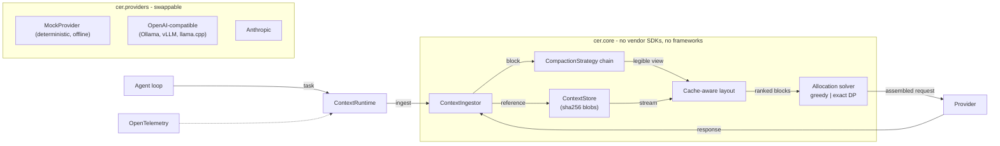
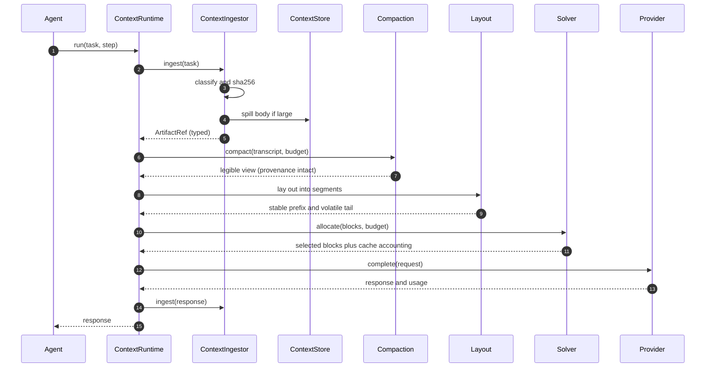
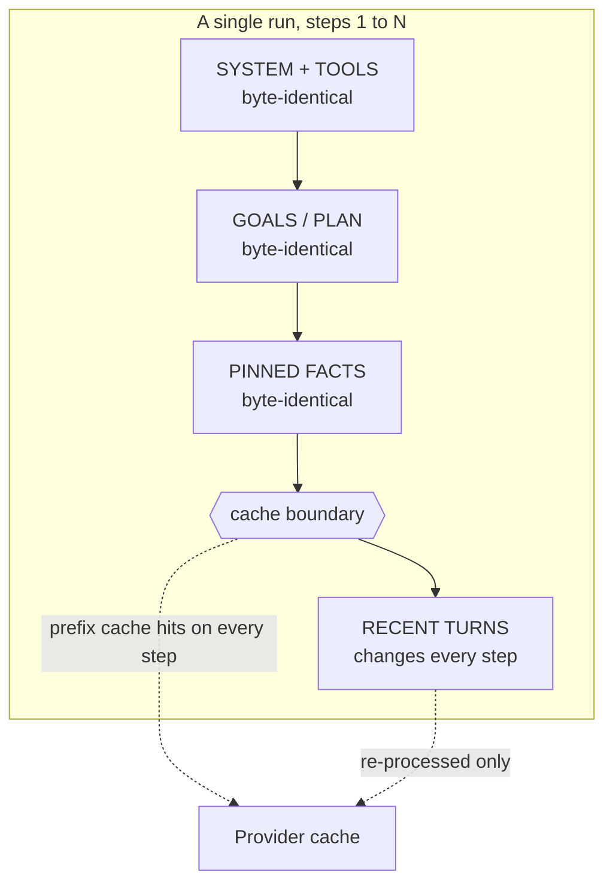

# ARCHITECTURE

CER sits between an agent loop and a model provider and owns context. This document
describes the components, the data flow, and the module map.

## Component diagram

## Sequence: one agent step

## Cache-aware layout

## Module map

| Module | Responsibility |
|---|---|
| `cer.types` | Immutable value types: `TokenBudget`, `Provenance`, `Utility`, `BlockRole`. |
| `cer.errors` | Typed exception hierarchy with remedies. |
| `cer.tokens` | The `TokenCounter` trait and the tiktoken-backed implementation. |
| `cer.store` | `ContextStore`, backends (memory / filesystem / S3), SQLite FTS5 metadata. |
| `cer.ingest` | `ContextIngestor`, artifact classification, offload, reference protocol. |
| `cer.layout` | Cache-aware segment layout and cache accounting. |
| `cer.solver` | `SOLVER_GREEDY` and `SOLVER_EXACT_DP` allocators. |
| `cer.compact` | Compaction strategies and composition. |
| `cer.assemble` | `ContextAssembler` and the allocation policy. |
| `cer.legibility` | The invariant checks and the `LegibilityError` guard. |
| `cer.providers` | The `Provider` trait and its adapters, including `MockProvider`. |
| `cer.config` | The single `ContextConfig` pydantic model. |
| `cer.runtime` | `ContextRuntime`, the facade that wires everything together. |
| `cer.bench` | Benchmark harness, ablation runner, Pareto frontier, efficacy index. |
| `cer.observability` | OpenTelemetry export. |

## Data flow summary

1. **Ingress.** Every artifact enters through `ContextIngestor`. It classifies by type,
   hashes the content, spills large bodies out of band, and returns a typed reference
   carrying provenance. Nothing reaches the provider unmediated.
2. **Storage.** `ContextStore` keeps bodies by content hash and hands back streams, not
   strings. Metadata lives in SQLite with an FTS5 index for lexical search. Pinned
   content survives eviction.
3. **Compaction.** A chain of strategies shrinks the transcript while preserving the
   contract: idempotent, pair-safe, error-safe, and pinned-safe. Every lossy step stays
   legible.
4. **Assembly.** Blocks are laid out into cache-aware segments, then the solver fills
   the token budget by utility per token, and the provider is called once.

## Invariants

| Invariant | Enforced by |
|---|---|
| Compaction is idempotent | `cer.compact` checks, plus the invariant suite. |
| Tool-call pairs are never split | `ToolCallPairing`, plus the invariant suite. |
| Errors are never dropped | `ToolCallPairing`, plus the invariant suite. |
| Pinned content is never evicted or summarized | Pin checks in compaction and the store. |
| Every lossy operation is visible and reversible | `cer.legibility`, gated in CI. |
| The reported token count never grows across a compaction pass | Compaction check. |
